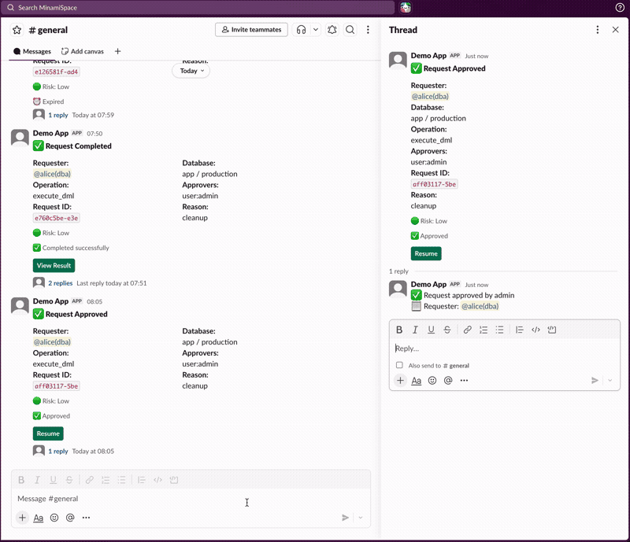

# Notifications

dbward can notify external systems when events occur — new requests, approvals, failures, emergency access. This page covers how to set up the delivery mechanisms. For controlling *which* events fire on *which* databases, see [Notification Policies](policies/notification-policies.md).

---

## Outbound: Generic Webhooks

### Configuration

```toml
[[webhooks]]
url = "https://your-service.com/dbward-events"
format = "generic"
secret = "${WEBHOOK_SECRET}"
events = ["request_created", "request_completed", "break_glass"]
```

| Field | Type | Default | Description |
|-------|------|---------|-------------|
| `url` | String | — | Delivery endpoint (HTTPS required in production) |
| `format` | String | `"generic"` | Payload format: `generic` or `slack` |
| `secret` | String | — | HMAC-SHA256 signing key |
| `events` | String[] | `[]` (all) | Filter events (empty = all events) |

### Payload format (generic)

```json
{
  "event": "request_created",
  "timestamp": "2025-01-15T10:30:00Z",
  "request": {
    "id": "req_abc123",
    "operation": "execute_dml",
    "database": "app",
    "environment": "production",
    "requester": "alice",
    "risk_level": "medium"
  }
}
```

### Signature verification

When `secret` is set, every delivery includes:

```
X-Webhook-Signature: sha256=<hex-encoded HMAC-SHA256 of body>
```

Verify in your receiver:

```python
import hmac, hashlib

expected = hmac.new(secret.encode(), request.body, hashlib.sha256).hexdigest()
actual = request.headers["X-Webhook-Signature"].removeprefix("sha256=")
assert hmac.compare_digest(expected, actual)
```

### Delivery guarantees

- Deliveries are persisted before sending (no lost events on crash)
- Failed deliveries retry up to 10 times with exponential backoff
- Timeout: 10 seconds per attempt
- Redirects are disabled (SSRF protection)
- Internal network addresses are blocked

### SQL redaction

SQL in webhook payloads is redacted by default:

```toml
[audit]
redaction = "literals"   # Replace literals with ? (default)
# redaction = "none"     # Send full SQL
# redaction = "full"     # Send hash only
```

---

## Outbound: Slack Notifications

Slack integration uses a dedicated `[slack]` config section for richer formatting and approve/reject buttons.

### 1. Create a Slack App

1. Go to [https://api.slack.com/apps](https://api.slack.com/apps) → **Create New App** → **From scratch**
2. Add **Bot Token Scopes**: `chat:write`, `channels:join` (recommended)
3. **Install to Workspace** → copy Bot Token (`xoxb-...`)
4. Copy **Signing Secret** from Basic Information

### 2. Configure server

```toml
[slack]
bot_token = "${SLACK_BOT_TOKEN}"
signing_secret = "${SLACK_SIGNING_SECRET}"
channel = "C02C1EUJ0EN"   # Default channel ID
```

Per-environment channels (optional):

```toml
[slack.channels]
production = "C02C1EUJ0EN"
staging = "C03D2FKJ1FO"
```

### 3. Message format

Slack messages include:
- Requester, database, environment, operation
- Risk level (🔴 High / 🟡 Medium / 🟢 Low)
- Required approvers (with mentions)
- **Review Request** button

Messages update in-place as the request progresses through its lifecycle.

**Security:** SQL is never shown in channel messages — only in the approval Modal (after authorization check).

---

## Inbound: Slack Interactions

Slack buttons enable one-click approve/reject directly from Slack.

### Setup

1. In your Slack App → **Interactivity & Shortcuts** → toggle **On**
2. Set **Request URL**: `https://your-server.com/api/slack/interactions`
3. Save

See [Slack: Handling user interaction](https://api.slack.com/interactivity/handling-user-interaction) for details.

### Flow

1. Approver clicks **Review Request**
2. Modal opens with: full SQL, risk details, EXPLAIN output
3. Approver selects Approve/Reject + adds comment
4. Request state updates, Slack message updates

<p align="center">
  
</p>

> The demo above shows the requester's perspective (create → approve → resume → result). Approvers follow the same flow via the **Review Request** button in their notifications.

### Slash Command

Create requests directly from Slack without CLI.

**Setup:**

1. In your Slack App → **Slash Commands** → **Create New Command**
2. Command: `/dbward`
3. Request URL: `https://your-server.com/api/slack/commands`
4. Short Description: `Execute SQL via approval workflow`
5. Usage Hint: `execute | help`
6. Save (reinstall app if prompted)

See [Slack: Implementing slash commands](https://api.slack.com/interactivity/implementing-slash-commands) for details.

**Commands:**

| Command | Action |
|---|---|
| `/dbward execute` | Open SQL submission modal |
| `/dbward help` | Show usage |

**Authentication:** No Bearer token required — both `/api/slack/commands` and `/api/slack/interactions` are verified using the [Slack Signing Secret](https://api.slack.com/authentication/verifying-requests-from-slack) (HMAC-SHA256). Only requests signed by Slack are accepted.

### Account linking

Each user links their Slack account:

```bash
dbward user update --slack-user-id U02CR3TMKKJ
```

Find your Member ID: Profile → **⋮** → **Copy member ID**.

Users without linked accounts can still approve via CLI/API.

---

## Troubleshooting

| Issue | Solution |
|---|---|
| No notifications sent | Check `[[webhooks]]` or `[slack]` config + env vars |
| `not_in_channel` | Invite bot: `/invite @dbward` or add `channels:join` scope |
| Signature mismatch | Verify secret matches between config and receiver |
| Button click error | Check Interactivity URL is correct and publicly accessible |
| "Account not linked" | Run `dbward user update --slack-user-id YOUR_ID` |
| `/dbward` shows "not a valid command" | Register Slash Command in Slack App settings |
| "No databases available" | User needs `request.query` or `request.execute` permission |

---

## Webhook vs Interactive: Choosing the Right Integration

dbward offers two independent Slack notification paths. They can be used alone or together.

| | Webhook (`format = "slack"`) | Interactive (`[slack]`) |
|---|---|---|
| **Setup** | `[[webhooks]]` + Incoming Webhook URL | `[slack]` + Bot Token + Signing Secret |
| **Delivery** | Incoming Webhook (passive) | Bot Token API (chat.postMessage) |
| **Approve/Reject** | ❌ CLI only | ✅ Buttons + Modal |
| **SQL in message** | ✅ Shown directly (redacted) | ❌ Only in Review Modal |
| **Thread replies** | ❌ Single message per event | ✅ Thread + message updates |
| **Mentions** | ❌ | ✅ @user notifications |

**Both enabled?** Both fire simultaneously. This is safe — webhook delivers a passive summary while interactive provides full button support.

### SQL visibility

The `format = "slack"` webhook displays redacted SQL directly in the channel message. This is by design — since Incoming Webhooks don't support buttons, the approver needs to see what they're approving from the notification alone.

If you don't want SQL visible in the Slack channel:

1. **Use Interactive only** — SQL is shown only inside the Review Modal (after authorization check)
2. **Use `format = "generic"`** — receive the raw JSON and format it yourself, omitting `detail`
3. **Set `redaction = "full"`** — replaces SQL with a hash (applies to both formats)

```toml
# Option 3: Hash-only redaction
[audit]
redaction = "full"
```

---

## See also

- [Notification Policies](policies/notification-policies.md) — control which events fire per database
- [Security Hardening](../security/hardening.md) — webhook security best practices
